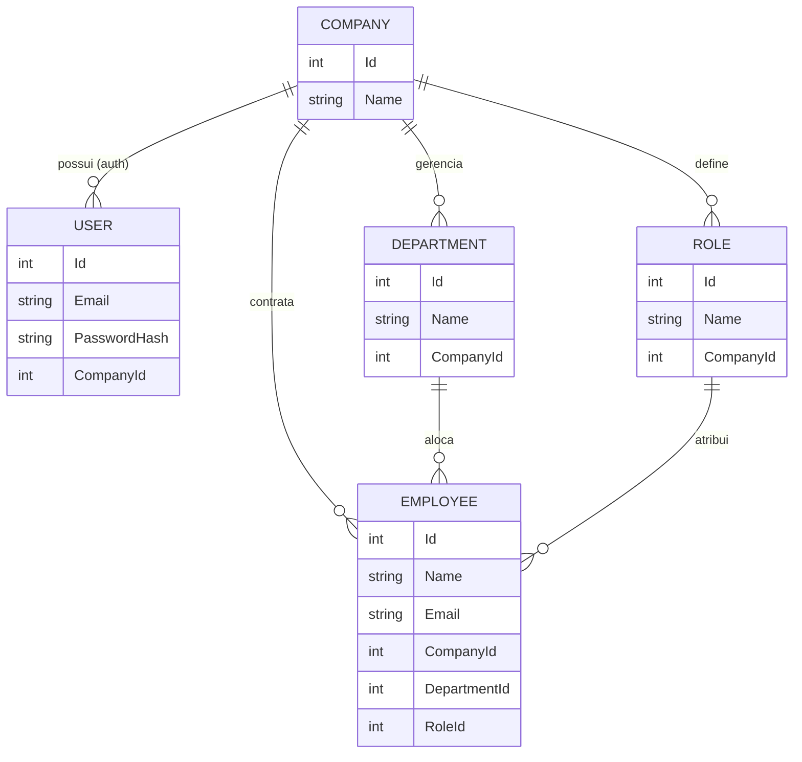
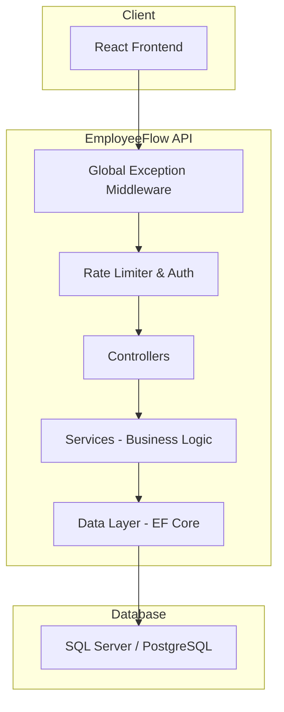

# EmployeeFlow API

API REST corporativa para gestão multi-empresa de funcionários, departamentos e cargos, desenvolvida com ASP.NET Core (.NET 9), SQL Server/PostgreSQL e autenticação JWT.

## 🔗 Links

- Documentação Scalar: https://employeeflow-api.duckdns.org/scalar/v1
- Frontend: https://employeeflow-web.vercel.app
- Repositório Frontend: https://github.com/VStorch/employeeflow-web.git


---

## 🚀 Tecnologias utilizadas

- ASP.NET Core 9
- Entity Framework Core
- SQL Server
- PostgreSQL (Npgsql)
- JWT Authentication
- AutoMapper
- Docker / Docker Compose
- Scalar (documentação de API)
- BCrypt (hash de senhas)
- Middleware global de exceções
- xUnit (testes unitários)
- FluentAssertions
- SQLite (in-memory para testes)

---

## 🗄️ Banco de dados

O projeto foi desenhado para ser agnóstico ao banco de dados, utilizando as abstrações do Entity Framework Core. Isso permite alternar entre diferentes provedores com alterações mínimas na camada de infraestrutura.

| Branch              | Provider            | Motivação                                |
| ------------------- | ------------------- | ---------------------------------------- |
| `main`              | PostgreSQL (Npgsql) | Otimização de recursos na OCI            |
| `sqlserver-version` | SQL Server 2022     | Compatibilidade com padrões corporativos |

### Diagrama de Entidades e Relacionamentos (ER)



**Relacionamento Company vs User (1:N):** Embora o fluxo atual contemple um usuário principal por empresa, optei pela relação 1:N para permitir escalabilidade futura. Isso possibilita que uma única organização possua múltiplos operadores com credenciais distintas no futuro.

---

## 🧱 Arquitetura

A aplicação foi estruturada seguindo uma arquitetura em camadas, promovendo separação de responsabilidades, desacoplamento e maior testabilidade.

Estrutura principal:

```bash
Controllers/
Services/
DTOs/
Entities/
Data/
Middleware/
Mappings/
Migrations/
```

### Diagrama de Fluxo



---

## ⚙️ Destaques Técnicos

- Global Exception Handling via Middleware
- Rate Limiting no endpoint de login contra brute force
- JWT Authentication com validação de lifetime e claims
- BCrypt para hash seguro de senhas
- Constraints de banco (Unique Email)
- Delete behaviors controlados (Cascade / Restrict)
- Uso de DTOs para isolamento da camada de domínio
- Isolamento de regras de negócio via camada de Services
- AutoMapper para mapeamento entre camadas
- Containerização completa com Docker Compose
- Testes unitários com banco relacional em memória (SQLite)
- Deploy em produção com a Oracle Cloud Infrastructure (OCI)
- Conventional Commits

---

## 📦 Funcionalidades

- **Gestão Multi-Empresa:** Isolamento de dados por organização.
- **Autenticação JWT:** Controle de acesso seguro com validação de claims e lifetime.
- **CRUD Corporativo:** Gestão completa de funcionários, departamentos e cargos.
- **Segurança de Login:** Rate limiting integrado no endpoint de autenticação contra brute force.
- **Documentação Viva:** Interface interativa gerada automaticamente via Scalar (`/scalar/v1`).

---

## 🔐 Autenticação JWT

A API utiliza autenticação baseada em JWT.

Fluxo:

1. Usuário realiza login (`/api/auth/login`)
2. API retorna token JWT
3. Token deve ser enviado no header:

`Authorization: Bearer {token}`

---

## 🐳 Docker

O projeto é totalmente containerizado utilizando Docker Compose.

A stack inclui:

- API ASP.NET Core
- PostgreSQL (Npgsql)
- Rede interna entre containers
- Variáveis de ambiente via .env

### Subir a aplicação

```bash
docker-compose up --build
```

### Variáveis de ambiente

Crie um arquivo `.env`:

```bash
DB_PASSWORD=SuaSenhaDoBanco
JWT_SECRET=SuaChaveJWT
```

---

## 🧪 Testes

O projeto possui testes unitários para validação das regras de negócio.

### Abordagem

- Uso de **xUnit** como framework de testes
- **FluentAssertions** para escrita expressiva dos testes
- **SQLite em memória** para simular o banco de dados
- Testes focados na camada de **Services**

### Cobertura atual

- Criação de funcionário (caso válido)
- Validação de relações (empresa, departamento, cargo)
- Tratamento de erros de domínio
- Violação de constraints (email duplicado)

### Executar testes

```bash
dotnet test
```

---

## ▶️ Executando o projeto localmente

1. Clonar o repositório

```bash
git clone https://github.com/VStorch/employeeflow-api.git
```

2. Configurar variáveis de ambiente

Crie um arquivo `.env`:

```bash
DB_PASSWORD=SuaSenhaDoBancoDeDados
```

Configure user-secrets do .NET:

```bash
dotnet user-secrets init

dotnet user-secrets set "ConnectionStrings:DefaultConnection" "Host=localhost;Port=5432;Database=employeeflow;Username=employeeflow;Password=SuaSenhaDoBancoDeDados"

dotnet user-secrets set "JwtSettings:Secret" "SuaChaveJWT"

dotnet user-secrets list
```

3. Rodar a aplicação

O projeto está configurado para aplicar automaticamente todas as Migrations pendentes no banco de dados assim que inicializa. Basta executar:

```bash
dotnet run
```

---

## 📄 Documentação da API

A API possui documentação interativa via **Scalar**:

```bash
/scalar/v1
```


---

## 👨‍💻 Autor

Vinícius Storch.

Projeto desenvolvido para fins de estudo e portfólio backend.
