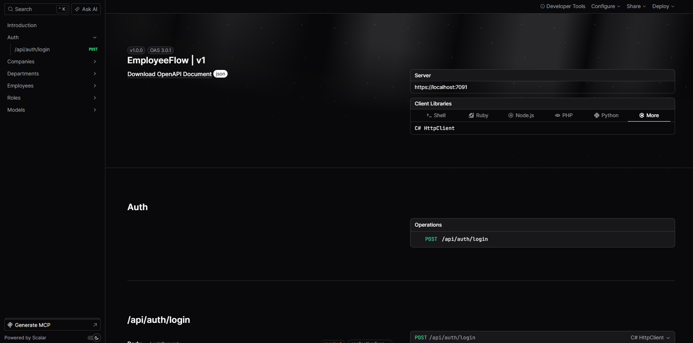

# EmployeeFlow

EmployeeFlow é uma API backend desenvolvida em **ASP.NET Core (.NET 9)** para gestão multi-empresa com autenticação JWT, controle de permissões e arquitetura escalável em camadas, simulando um sistema real corporativo de RH.


---

## 🚀 Tecnologias utilizadas

- ASP.NET Core 9
- Entity Framework Core
- SQL Server
- JWT Authentication
- AutoMapper
- Docker / Docker Compose
- Scalar (documentação de API)
- BCrypt (hash de senhas)
- Middleware global de exceções
- xUnit (testes unitários)
- FluentAssertions
- SQLite (in-memory para testes)

---

## 🧱 Arquitetura

O projeto segue uma arquitetura em camadas:

- **Controllers** → Camada de entrada (HTTP)
- **Services** → Regras de negócio
- **Data** → DbContext e acesso ao banco
- **DTOs** → Contratos de entrada e saída
- **Entities** → Modelos de domínio
- **Mappings** → Perfis do AutoMapper
- **Middleware** → Tratamento global de erros
- **Exceptions** → Exceções customizadas
- **Helpers** → Extensões auxiliares (claims, etc.)

---

## 📦 Funcionalidades

### Autenticação

- Login com JWT
- Validação de token
- Proteção de rotas

### Empresas

- Criar, editar, listar e remover empresas

### Departamentos

- CRUD completo
- Associação com empresas

### Funcionários

- CRUD completo
- Associação com departamentos e cargos

### Roles

- Gerenciamento de permissões/cargos

---

## 🔐 Autenticação JWT

A API utiliza autenticação baseada em JWT.

Fluxo:

1. Usuário realiza login (`/api/auth/login`)
2. API retorna token JWT
3. Token deve ser enviado no header:

`Authorization: Bearer {token}`

---

## 🐳 Docker

O projeto é totalmente containerizado utilizando Docker Compose.

A stack inclui:

- API ASP.NET Core
- SQL Server 2022
- Rede interna entre containers
- Variáveis de ambiente via .env

### Subir a aplicação

```bash
docker-compose up --build
```

### Variáveis de ambiente

Crie um arquivo `.env`:

```bash
DB_PASSWORD=SuaSenhaDoBanco
JWT_SECRET=SuaChaveJWT
```

---

## 🧪 Testes

O projeto possui testes unitários para validação das regras de negócio.

### Abordagem

- Uso de **xUnit** como framework de testes
- **FluentAssertions** para escrita expressiva dos testes
- **SQLite em memória** para simular o banco de dados
- Testes focados na camada de **Services**

### Cobertura atual

- Criação de funcionário (caso válido)
- Validação de relações (empresa, departamento, cargo)
- Tratamento de erros de domínio
- Violação de constraints (email duplicado)

### Executar testes

```bash
dotnet test
```

---

## ⚙️ Destaques técnicos

- Global Exception Handling via Middleware
- Rate Limiting no endpoint de login contra brute force
- JWT Authentication com validação de lifetime e claims
- Containerização completa com Docker Compose
- Constraints de banco (Unique Email)
- Delete behaviors controlados (Cascade / Restrict)
- Uso de DTOs para isolamento da camada de domínio
- AutoMapper para mapeamento entre camadas
- Testes unitários com banco relacional em memória (SQLite)
- Isolamento de regras de negócio via camada de Services

---

## ▶️ Executando o projeto localmente

1. Clonar o repositório

```bash
git clone https://github.com/VStorch/employeeflow-api.git
```

2. Configurar variáveis de ambiente

Crie um arquivo `.env`:

```bash
DB_PASSWORD=SuaSenhaDoBancoDeDados
```

Configure user-secrets do .NET:

````bash
dotnet user-secrets init

dotnet user-secrets set "ConnectionStrings:DefaultConnection" "Server=localhost,1433;Database=EmployeeFlowDb;User Id=sa;Password=SuaSenhaDoBancoDeDados;TrustServerCertificate=True;"

dotnet user-secrets set "JwtSettings:Secret" "SuaChaveJWT"

dotnet user-secrets list // Para ver os segredos criados
```

3. Executar migrations

```bash
dotnet ef database update
```

4. Rodar a aplicação

```bash
dotnet run
````

---

## 📄 Documentação da API

A API possui documentação interativa via **Scalar**:

```bash
/scalar/v1
```



---

## 📌 Boas práticas aplicadas

- Arquitetura em camadas com separação de responsabilidades
- Middleware global para exceções
- DTOs para isolamento da camada de domínio
- Autenticação segura com JWT
- Senhas armazenadas com hash (BCrypt)
- Uso de migrations para versionamento do banco
- Versionamento de commits seguindo Conventional Commits

---

## 📁 Estrutura principal

```bash
Controllers/
Services/
DTOs/
Entities/
Data/
Middleware/
Mappings/
Migrations/
```

---

## 👨‍💻 Autor

Vinícius Storch.

Projeto desenvolvido para fins de estudo e portfólio backend.
